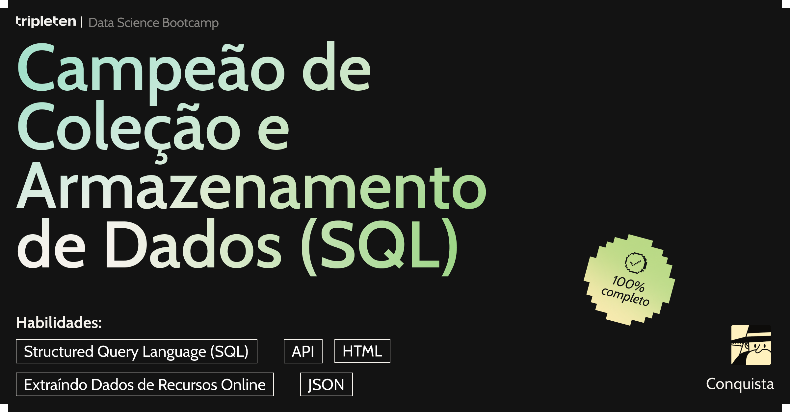

# Hey everyone, I'm Thiago Zanin! 

### Passionate about Data Science, analytics, and turning data into insights. Constantly learning and exploring new technologies!  
With over a decade of experience in tech, I’ve also worked as a web developer building full-featured websites and systems using a wide range of languages and frameworks like JavaScript, PHP, HTML, CSS, and modern frontend stacks. My current focus is applying data science and machine learning to solve real-world problems.

### 🛠️ Technologies I use in my day

 
    
    
    
    
    
    
    
    

 

---

#### 📫 Find me on LinkedIn::

---

### 💼 Technologies I’ve worked with:

 
    
    
    
    
    
    

 

### 📊 GitHub Stats

---

    
           

---

# Data Science Project
|    Project Title  | Code / Notebook    | Technologies    | Overview  | 
| ------------        | ------------        | ------------ |------------ |
| **Churn Prediction - Interconnect** | [GitHub Repo](https://github.com/t-zanin/projeto-churn-interconnect/) | Python (Scikit-learn)| This project was developed as part of a final sprint to predict customer churn for the telecommunications provider Interconnect. The task involved analyzing customer personal data, plans, and contracts to identify churn patterns and create a machine learning model. The goal is to provide insights that allow the company to offer promotional codes and special plans to retain at-risk customers. The dataset includes information on contracts, personal data, internet, and phone services.|
| **Megaline Telecom Revenue Analysis** | [GitHub Repo](https://github.com/t-zanin/DS-megaline) | Python (Pandas, NumPy, Matplotlib, Seaborn, SciPy (for statistical tests))| This project analyzes customer behavior and revenue generation for Megaline, a telecommunications company offering two prepaid plans: Surf and Ultimate. The goal is to determine which plan generates more revenue to optimize the company’s advertising budget. Based on a sample of 500 customers, the analysis examines call, text, and data usage patterns in 2018 to identify revenue trends and provide actionable insights.|
| **Game Sales Analysis - Ice Project** | [GitHub Repo](https://github.com/t-zanin/DS-ICE) | Python (Pandas, NumPy, Matplotlib,SciPy)| This project was developed for a data analysis learning sprint. The goal is to analyze historical video game sales data from the Ice online store, which sells games globally, to identify patterns that determine a game's success.|

---

---

### 📜 Certificates

Below are some of the certifications I've earned throughout my journey in Data Science and Technology:

| Certificate | Issuer | Skills | Link |
|---------|--------|--------|------|
| **CS50: Introduction to Computer Science**  | Harvard University | C, Python, Algorithms, Web Dev | [See Credential](https://cs50.harvard.edu/certificates/) |
| **Data Science - Bootcamp TripleTen**  | TripleTen | Python, ML, SQL, Statistics, Projects | [TripleTen](https://tripleten.com) |

---

### 🏅 Certificate Highlights
 
🗂️ **SQL & Data Collection** – Skills: SQL, API, HTML, JSON

 
🤖 **Machine Learning Mastery** – Skills: Model training, Validation, Neural networks

 
  
📊 **Business Decision Making with ML** – Skills: Metrics, Classification, scikit-learn

